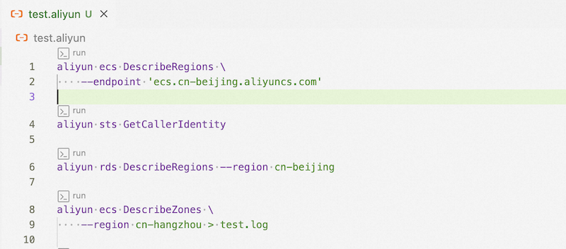
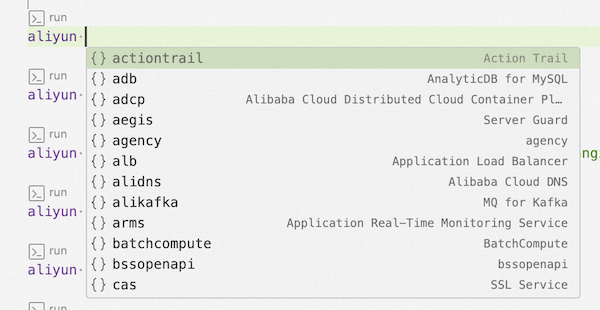
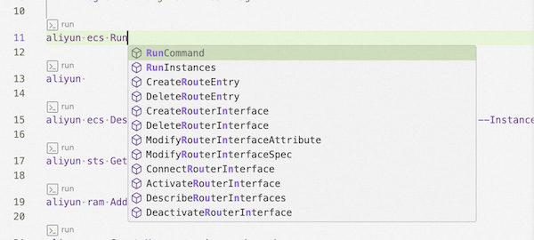
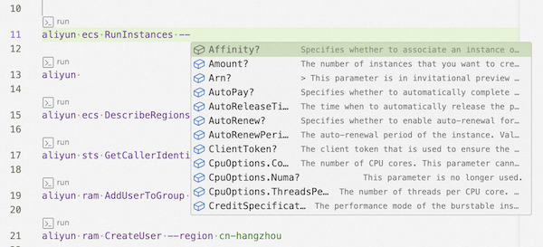

# VS Code extension for Alibaba Cloud CLI

Notes for developing and running commands with the [Alibaba Cloud CLI](https://github.com/aliyun/aliyun-cli).

## Features

### Alibaba Cloud commands

- [x] Syntanx highlight for `.aliyun` files
- [x] Codelens for Alibaba Cloud CLI commands
- [x] Run Alibaba Cloud CLI command in terminal
- [x] Run Alibaba Cloud CLI command in editor

- [x] Support command auto-completion

### Profiles management

- [x] Switch between profiles

### Installation

- [x] Auto-detect Alibaba Cloud CLI installation

## Requirements

- Need VS Code 1.75.0 or above.

## Release Notes

### 1.0.0

Initial release

---

## License

See the [MIT License](./LICENSE).

## For more information

- [Alibaba Cloud CLI](https://github.com/aliyun/aliyun-cli)
